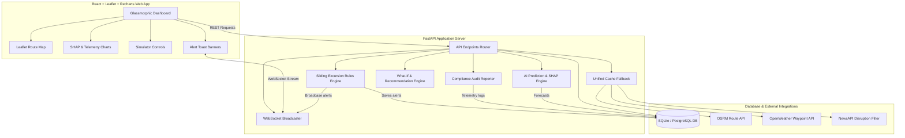

# FlowSense AI: Intelligent Cold Chain Monitoring & Decision Support

FlowSense AI is an explainable AI-powered decision support system designed for India's pharmaceutical distribution. Specifically, it empowers a District Cold Chain Officer in Maharashtra to manage vaccine and insulin shipments from Mumbai hubs to district hospitals and primary health centers (PHCs), directly tackling thermal excursions and transit delay losses (Rs 15-20 lakh/year).

---

## System Architecture



---

## Core Features & Modules

### 1. External Data Ingestion Pipeline (Feature 1)
- **Spatial Route Analysis**: Queries OSRM for driving geometries, durations, and distances between Maharashtra cities. Caches route details (24-hour TTL) with a Haversine fallback.
- **Weather & Traffic Filters**: Fetches OpenWeather API forecasts along route waypoints (1-hour cache). Queries NewsAPI for highway disruptions (floods, closures) and filters incidents within a 50km radius of the route path coordinates.
- **IoT Simulator**: Simulates telemetry readings (temperature, humidity, timestamp) inside vaccine cold boxes.

### 2. Shipment & Cold Chain Management (Feature 2)
- **Maharashtra Geocoding**: Automatically geocodes cities (Mumbai, Pune, Nashik, Aurangabad, Nagpur, etc.) and analyzes routes on shipment creation.
- **WebSocket Alert Broadcaster**: Runs rules checks on telemetry logs continuously. Broadcasters push instant notifications over WebSocket when transit delays or sliding temperature excursions (e.g. continuous breaches outside 2-8°C for >30 minutes) are detected.

### 3. AI Predictions & Explainability Engine (Feature 3)
- **Transit Delay Forecasts**: Estimates delays using weather elements, traffic disruptions, and carrier reliability metrics. Returns analytical Shapley values distributing interaction terms equally.
- **Thermal Spoilage Risk**: Computes spoilage probabilities using a logistic regression function. Computes exact Shapley values combinatorially across all $2^3 = 8$ subsets to resolve the non-linear sigmoid interaction precisely.
- **Multiplicative Turnout Demand**: Forecasts vaccine demand based on monsoon precipitation drops, seasonal surges, and historical clinic turnout, with SHAP explainability.

### 4. What-If Simulator & Decision Support (Feature 4)
- **In-Memory Simulations**: Allows District Officers to preview hypothetical parameter shifts (logistics carriers, cold boxes, departure times) in memory without database modifications.
- **Decision Recommendations**: Automatically scans all database carriers, active cold boxes, and alternative departure times, returning a ranked list of optimizations sorted by predicted spoilage risk reduction.

### 5. React Dashboard UI (Feature 5)
- **Leaflet Maps**: Renders color-coded routes (Green = Low, Orange = Medium, Red = High risk) with waypoint weather and traffic alert icons.
- **Explainability Charts**: Visualizes positive and negative SHAP risk factors in a clear horizontal bar chart, alongside Recharts telemetry graphs.
- **Live Alert Banner**: Streams live alerts with one-click REST acknowledgment.

### 6. Compliance Auditing & Exports (Feature 6)
- **Excursion Report**: Traces continuous excursion segment timelines, tracking breach duration, max/min temps, and overall regulatory status.
- **Monthly Summary**: Tracks cumulative financial losses (assuming Rs 250 per spoiled vial) and ranks logistics providers by compliance scores.
- **CSV Data Exporters**: Downloads raw shipment telemetry logs and district monthly audit spreadsheets.

---

## Installation & Setup

### Prerequisites
- Python 3.10+
- Node.js 18+

### 1. Backend Server Setup
1. Clone the repository and navigate to the project root:
   ```bash
   cd flowsense_AI
   ```
2. Create and activate a Python virtual environment:
   ```bash
   python -m venv .venv
   # Windows:
   .venv\Scripts\activate
   # Linux/Mac:
   source .venv/bin/activate
   ```
3. Install backend dependencies:
   ```bash
   pip install -r requirements.txt
   ```
4. Run Alembic database migrations:
   ```bash
   alembic upgrade head
   ```
5. Start the FastAPI development server:
   ```bash
   uvicorn app.main:app --reload
   ```
   *The Swagger API documentation will be available at `http://localhost:8000/docs`.*

### 2. Frontend React Setup
1. Navigate to the `frontend` directory:
   ```bash
   cd frontend
   ```
2. Install package dependencies:
   ```bash
   npm install
   ```
3. Start the Vite development web server:
   ```bash
   npm run dev
   ```
   *The dashboard will be available at `http://localhost:5173`.*

---

## Running Integration Tests

To run the complete test suite (containing OSRM mocks, prediction SHAP tests, What-If simulator tests, and compliance reports assertions):
```bash
# From the project root directory
.venv\Scripts\python -m pytest -p no:asyncio tests/
```
All tests should pass successfully:
```bash
====================== 17 passed, 133 warnings in 7.00s =======================
```
