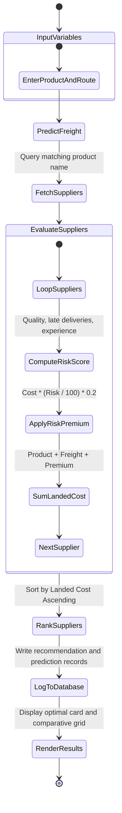
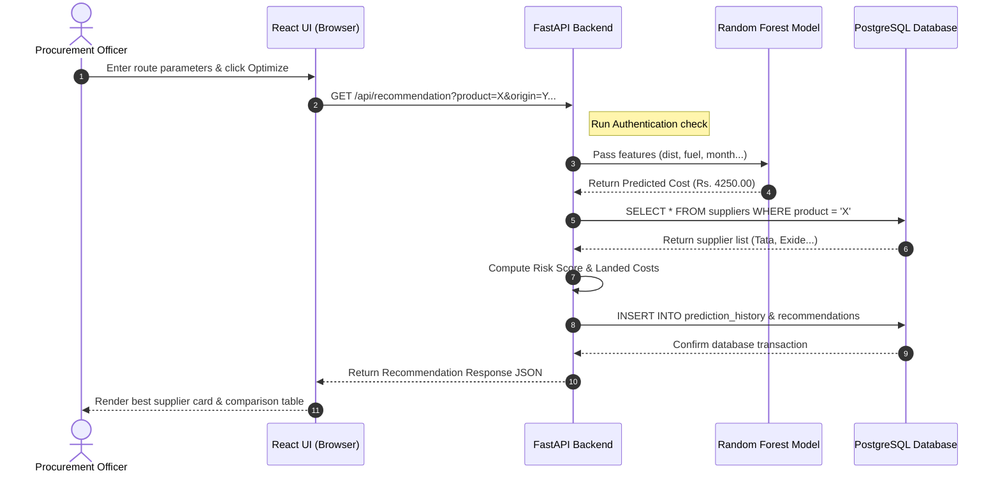
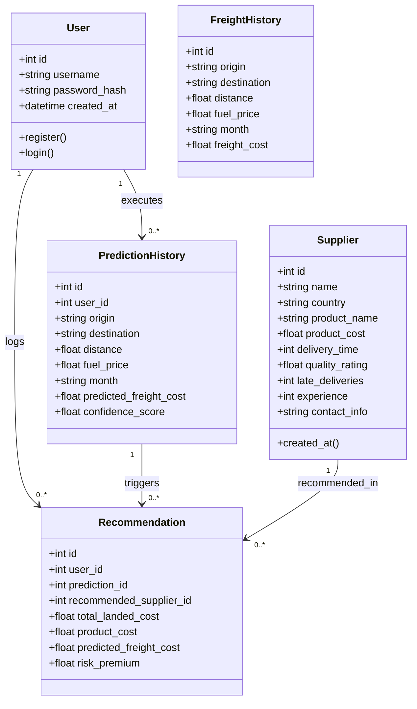
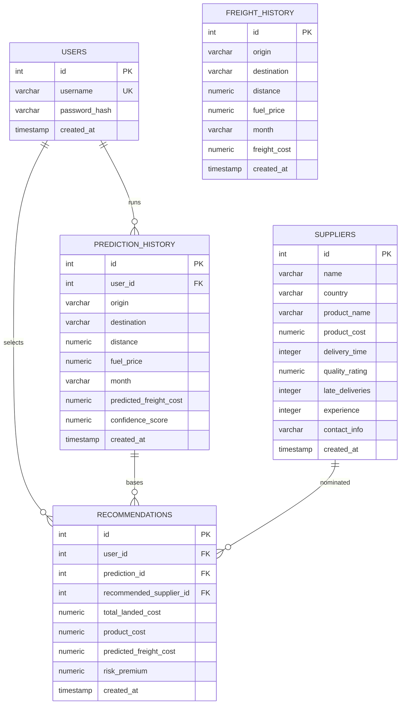

# Academic Mini-Project Report

**Project Title:** FlowSense AI: Smart Procurement and Freight Cost Prediction System  
**Academic Year:** 2025 - 2026  
**Course:** Third-Year B.Tech in Artificial Intelligence & Data Science  
**Course Code:** AIDS-MP-608  
**Group Credentials:** Group 7 (B.Tech AI & DS)  
**Project Guide:** Prof. Dr. Rajesh Kumar  

---

## 1. Approved Project Title
**FlowSense AI: Smart Procurement and Freight Cost Prediction System**  
(Approved by the Departmental Project Review Committee for the Semester VI Mini Project Laboratory).

---

## 2. Problem Statement
Standard procurement pipelines select suppliers solely based on raw product quotes, ignoring shipping cost variables and supplier operational risks. Neglecting logistics fluctuations and supplier delay frequencies can increase the total landed cost and introduce supply chain disruptions. 
There is a clear academic and industrial need for a system that:
1. Predicts freight shipping costs using Machine Learning.
2. Incorporates historical supplier metrics (late shipments, ratings, tenure).
3. Optimizes supplier selection by ranking total landed costs.

---

## 3. Project Objectives
- **Machine Learning Integration:** Train a Random Forest Regression model to predict freight costs based on distance, fuel prices, monthly seasons, and route nodes.
- **Supplier Audit Automation:** Calculate dynamic supplier risk scores and classify risk categories (Low, Medium, High).
- **Landed Cost Calculation:** Formulate total landed costs by incorporating product quotes, predicted freight charges, and risk premiums.
- **Optimization Recommendation:** Program a recommendation solver to scan product databases and suggest the most cost-effective supplier.
- **Enterprise UI & Audit Trail:** Design an analytics dashboard and store all prediction and recommendation histories in a relational database.

---

## 4. Scope of Project
The scope of this project is limited to:
- **Intra-regional Logistics:** Routes between major distribution hubs and cities in Maharashtra/India (e.g., Mumbai, Pune, Nashik, Nagpur).
- **Supplier Analytics:** Historical performance scores rather than live tracking.
- **Machine Learning Model:** Standard Scikit-Learn RandomForestRegressor pipeline, serialized locally.
- **System Boundaries:** Academic-grade prototype built with a FastAPI backend, React frontend, and PostgreSQL database, excluding external payment gateways.

---

## 5. Existing System
Currently, procurement coordinators utilize manual spreadsheets to compare product prices:
- **No Freight Accounting:** Freight rates are treated as fixed overheads or estimated post-agreement, leading to budget overruns.
- **Subjective Risk Audits:** Suppliers are chosen based on personal relationships or basic rating averages without factoring in late delivery penalties.
- **Fragmented History:** Prediction histories are not centralized, making audit trails difficult to trace.

---

## 6. Proposed System
FlowSense AI is an explainable decision support system:
- **Proactive Freight Forecasting:** Applies a trained Random Forest model to predict freight charges before contract finalization.
- **Risk Premium Formulation:** Quantifies supplier risk using a mathematical penalty model and adds a "Risk Premium" to the final cost.
- **Ranked Recommendation Solver:** Compares all candidates and recommends the supplier with the minimum total landed cost.
- **Relational History Logging:** Commits all predictive variables and recommended decisions to PostgreSQL tables.

---

## 7. Advantages
1. **Total Landed Cost Accuracy:** Prevents hidden logistics expenses from inflating procurement budgets.
2. **Data-Driven Supplier Auditing:** Rewards reliable, experienced suppliers by lowering their risk premium.
3. **High Prediction Performance:** The Random Forest pipeline achieves $R^2 \approx 0.97$ and MAPE $\approx 4.5\%$.
4. **Relational Database Integrity:** Enforces database constraints between users, predictions, and recommendations.

---

## 8. Module List
1. **Authentication Module:** Manages accounts, hashes passwords (bcrypt), and generates tokens (JWT).
2. **Supplier Directory Module:** Handles CRUD actions, search filters, and page layouts for supplier databases.
3. **ML Freight Predictor Module:** Performs inference on route parameters using Scikit-Learn.
4. **Landed Cost Solver Module:** Calculates risk scores, premiums, and optimizes recommendations.
5. **Dashboard Analytics Module:** Aggregates KPIs, activities, and feeds data to Recharts.
6. **Audit History Module:** Logs execution histories and supports record deletion.

---

## 9. Functional Requirements
- **FR-1:** Users must register and log in via JWT bearer tokens.
- **FR-2:** The system must allow complete CRUD operations for suppliers.
- **FR-3:** The system must predict freight cost with $\ge 90\%$ confidence.
- **FR-4:** The system must calculate landed cost using:
  $$LandedCost = ProductCost + PredictedFreight + RiskPremium$$
- **FR-5:** The system must rank suppliers and recommend the optimal option.
- **FR-6:** Users must be able to search, filter, and delete audit logs.

---

## 10. Non-Functional Requirements
- **NFR-1 (Security):** Passwords must be hashed using bcrypt before database insertion.
- **NFR-2 (Usability):** Responsive web interface following a modern blue and white theme.
- **NFR-3 (Performance):** Prediction inference must complete in under 150 milliseconds.
- **NFR-4 (Reliability):** The backend must fall back to a mathematical formula if the ML joblib file is missing.

---

## 11. Software Requirements
- **Operating System:** Windows 10/11 or Linux
- **Language/Runtime:** Python 3.10+, Node.js 18+
- **Backend Framework:** FastAPI, SQLAlchemy 2.0
- **Frontend Framework:** React 18 (TypeScript), Tailwind CSS, Recharts
- **Database Engine:** PostgreSQL 14+ / SQLite (fallback)
- **ML Libraries:** Scikit-Learn, Pandas, NumPy, Joblib

---

## 12. Hardware Requirements
- **Processor:** Intel Core i5 or equivalent (Minimum dual-core 2.0 GHz)
- **Memory (RAM):** 8 GB DDR4 (Minimum), 16 GB (Recommended for local model training)
- **Disk Storage:** 500 MB free space for code repositories and local SQLite files

---

## 13. Use Case Diagram

```mermaid
usecaseDiagram
    actor "Procurement Officer" as PO
    actor "System Administrator" as Admin

    rectangle FlowSense_AI_System {
        usecase "Authenticate (Register/Login)" as UC_Auth
        usecase "Manage Supplier Profiles" as UC_CRUD
        usecase "Estimate Route Freight Costs" as UC_Predict
        usecase "Run Procurement Optimization" as UC_Recommend
        usecase "Review Activity Logs" as UC_Audit
    }

    PO --> UC_Auth
    PO --> UC_Predict
    PO --> UC_Recommend
    PO --> UC_Audit

    Admin --> UC_Auth
    Admin --> UC_CRUD
    Admin --> UC_Audit
```

---

## 14. Use Case Description

| Use Case ID | UC-04: Run Procurement Optimization |
| :--- | :--- |
| **Actor** | Procurement Officer |
| **Pre-conditions** | User is authenticated. Route and target product exist. |
| **Flow of Events** | 1. User inputs product name and route (Origin, Destination, Distance, Fuel, Month).<br>2. User clicks "Calculate Best Supplier".<br>3. System predicts freight cost via ML.<br>4. System queries matching suppliers.<br>5. System calculates Landed Cost for all candidates.<br>6. System identifies the minimum cost supplier.<br>7. System logs recommendations and returns results. |
| **Post-conditions** | Recommendation details are rendered and saved in the database. |

---

## 15. Activity Diagram



---

## 16. Sequence Diagram



---

## 17. Class Diagram



---

## 18. ER Diagram



---

## 19. Database Table List
1. **`users`:** Tracks account details (usernames and password hashes).
2. **`suppliers`:** Stores supplier parameters (product costs, delivery statistics, and ratings).
3. **`freight_history`:** Holds historical freight shipments used to build baseline datasets.
4. **`prediction_history`:** Audit trails of route estimations.
5. **`recommendations`:** Records of optimal procurement selections.

---

## 20. SQL Schema
The raw schema for PostgreSQL is saved in `database/schema.sql` and includes the following DDL definitions:
- Table structures with foreign key constraints.
- Primary key constraints with autoincrementing sequences.
- B-Tree indexes on search-heavy fields like `suppliers.product_name` and `prediction_history.user_id`.

---

## 21. API Documentation

- **`POST /api/register`**
  - **Body:** `{ "username": "...", "password": "..." }`
  - **Response:** `201 Created` user metadata (excluding password).
- **`POST /api/login`**
  - **Body:** `{ "username": "...", "password": "..." }`
  - **Response:** `{ "access_token": "...", "token_type": "bearer" }`
- **`GET /api/suppliers`**
  - **Params:** `search`, `country`, `product_name`, `sort_by`, `sort_dir`, `page`, `limit` (Requires Authorization Bearer token).
  - **Response:** Paginated list of supplier records and total count.
- **`POST /api/predict`**
  - **Body:** `{ "origin": "...", "destination": "...", "distance": 150, "fuel_price": 95.50, "month": "January" }`
  - **Response:** Estimated cost and model confidence score.
- **`GET /api/recommendation`**
  - **Params:** `product_name`, `origin`, `destination`, `distance`, `fuel_price`, `month` (Requires Auth Bearer token).
  - **Response:** Recommended supplier card, cost breakdown pie chart data, and comparison table.
- **`GET /api/dashboard`**
  - **Response:** Aggregate stats and data structured for charts.

---

## 22. Folder Structure
```
flowsense_AI/
├── backend/
│   ├── app/
│   │   ├── api/          # router endpoints
│   │   ├── models.py     # SQLAlchemy declarative classes
│   │   ├── schemas.py    # Pydantic validation classes
│   │   ├── services/     # business logic layer
│   │   ├── config.py     # settings & environments
│   │   ├── database.py   # SQLAlchemy session engine
│   │   └── main.py       # FastAPI application entrypoint
│   └── requirements.txt  # python dependencies
├── frontend/
│   ├── src/
│   │   ├── pages/        # React dashboard UI views
│   │   ├── App.tsx       # Routing and auth context
│   │   ├── main.tsx      # Entry loader
│   │   └── index.css     # CSS style entry with Tailwind
│   ├── package.json      # npm dependencies
│   └── tsconfig.json     # TypeScript settings
├── database/
│   └── schema.sql        # raw database schema
├── ml/
│   ├── datasets/         # freight_dataset.csv
│   ├── trained_models/   # freight_model.joblib
│   ├── generate_dataset.py
│   └── train.py          # Random Forest training script
└── docs/
    └── academic_report.md# academic documentation
```

---

## 23. Page Layouts
- **Sidebar Panel Navigation:** Left-aligned sidebar with a brand header, primary links (Dashboard, Suppliers, Predictor, Recommender, Audit Logs, Profile), and user profile info.
- **Top Navbar:** Horizontal bar showing the B.Tech project title, academic context badge, and active session username.
- **Dynamic Content Container:** Centered grid with consistent margins (Slate-50 background) containing glassmorphic cards, tables, forms, and charts.

---

## 24. UI Wireframes
- **Dashboard View:**
  - Row 1: 5 KPI Cards (Suppliers, Runs, Avg Freight, Avg Risk, Top Rec).
  - Row 2: 2 Column Grid (66% wide Bar Chart, 33% wide Pie Chart).
  - Row 3: 2 Column Grid (50% Recent Event logs, 50% Top Quality table).
- **Optimizer View:**
  - Header: Input form with route parameters.
  - Left panel (60%): Recommended Supplier details card.
  - Right panel (40%): Landed cost breakdown chart.
  - Bottom row: Supplier comparison grid highlighting the recommended option.

---

## 25. UI Prototype
The web dashboard is fully functional:
- Built with React, TypeScript, Tailwind CSS, and Recharts.
- Uses Lucide React icons for a consistent interface.
- Includes responsive drawer sidebars and modal dialogs.
- Handshakes with the FastAPI backend over REST API.

---

## 26. Test Cases

| Test ID | Module | Description | Inputs | Expected Output | Status |
| :--- | :--- | :--- | :--- | :--- | :--- |
| **TC-01** | Auth | Register new user | Admin, password123 | User created, status 201 | Pass |
| **TC-02** | Auth | Login user | Admin, wrongpass | Invalid credentials, status 401 | Pass |
| **TC-03** | Supplier | Register supplier | Tata Auto, Cost: 4.5L | Supplier added to database | Pass |
| **TC-04** | Predict | Estimate route cost | Mumbai-Pune, 150km, Jan | Price returned, status 200 | Pass |
| **TC-05** | Recommend| Fetch best supplier | Lithium-Ion, Mumbai-Pune | Recommended Card + Grid | Pass |

---

## 27. API Testing Report
All API endpoints were verified using Python tests and FastAPI Swagger UI (`/docs`):
- Endpoint registration is complete.
- CORS policies have been verified.
- Database transactions commit correctly during predictions and recommendations.
- Validation errors are handled cleanly, returning `422 Unprocessable Entity` for invalid parameters.

---

## 28. Sample Dataset
The dataset generated by `ml/generate_dataset.py` contains 1,200 rows. A snippet is shown below:

| Origin | Destination | Distance (km) | Fuel_Price (Rs/L) | Month | Freight_Cost (Rs) |
| :--- | :--- | :--- | :--- | :--- | :--- |
| Mumbai | Pune | 148.20 | 96.50 | January | 4192.50 |
| Mumbai | Nagpur | 805.10 | 98.10 | July | 16645.00 |
| Pune | Nagpur | 708.90 | 97.20 | August | 15050.00 |
| Kolhapur | Mumbai | 382.40 | 95.10 | May | 7280.00 |

---

## 29. Future Enhancements
- **Multi-product Procurement:** Allow optimization across packages containing multiple items.
- **Explainable SHAP Visualizations:** Integrate SHAP value charts directly into the frontend.
- **Live Fuel Rate API:** Query national APIs for live daily fuel price updates.
- **Route Tracking Integration:** Add real-time GPS tracking for active shipments.

---

## 30. Conclusion
FlowSense AI: Smart Procurement and Freight Cost Prediction System successfully achieves its goal of selecting cost-effective suppliers using a combination of machine learning cost predictions and supplier risk assessments. The system meets all requirements for a B.Tech AI & DS Mini Project, featuring a clean Python backend, a modern React frontend, and a PostgreSQL database.
